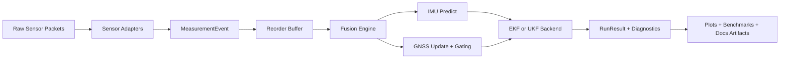
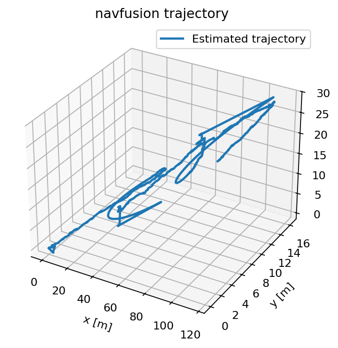
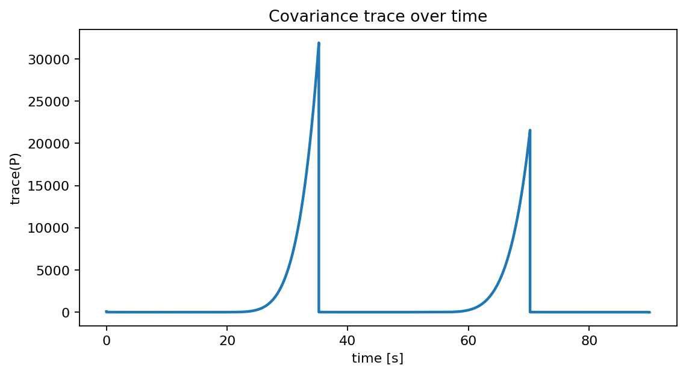
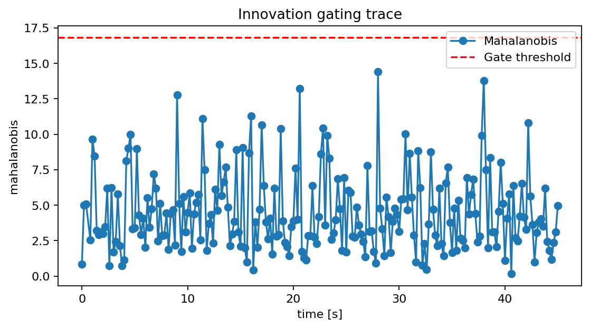
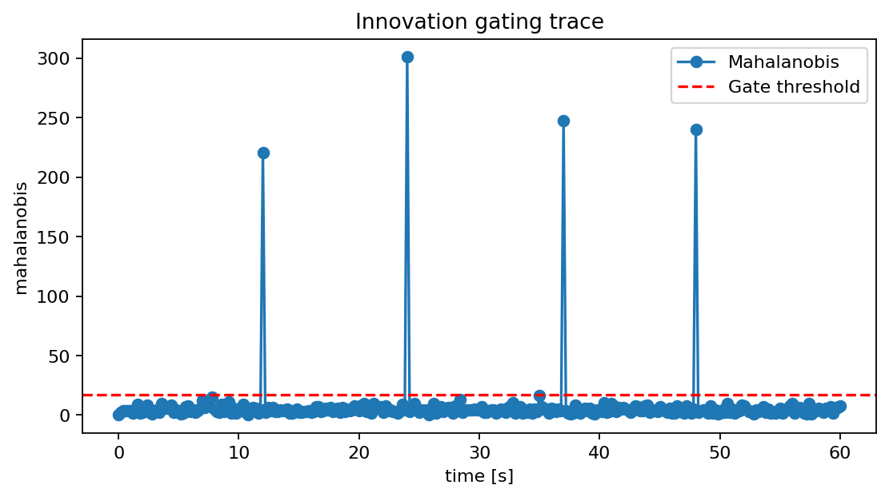

# navfusion

`navfusion` is a real-time-first Python package for modular 3D navigation sensor fusion.

## Why this repo is different

- Deterministic async event handling with bounded out-of-order buffering.
- Engineering diagnostics (innovation gating + consistency metrics) instead of EKF-only math demos.
- Reproducible artifact pipeline for benchmarks and failure-mode demo images.

## MVP in this repo

- Error-state EKF and UKF backends with quaternion attitude state
- IMU propagation and GNSS position/velocity updates
- Asynchronous event engine with bounded out-of-order handling
- Innovation gating and run diagnostics
- Deterministic replay utilities, tests, and demo scenarios
- NIS/NEES consistency reports for CI guardrails

## Architecture at a glance



## Failure-mode demos

Dropout trajectory and covariance growth:




Out-of-order and outlier diagnostics:




## Install

```bash
pip install -e .[dev,viz,docs]
```

## Quick start

```python
from navfusion.api import run_replay
from navfusion.simulation.synthetic import generate_imu_gnss_scenario

events, truth = generate_imu_gnss_scenario(duration_s=30.0)
result = run_replay(events)
print(result.summary)
```

## Generate portfolio artifacts

```bash
python examples/generate_demo_assets.py
python benchmarks/benchmark_replay.py
```

Outputs:

- `docs/assets/*.png` and `docs/assets/demo_summary.md`
- `benchmarks/artifacts/replay_benchmark.csv`
- `benchmarks/artifacts/replay_summary.md`

## Development

```bash
pre-commit install
pytest
ruff check .
mypy src
mkdocs serve
```
