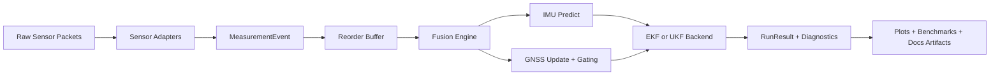

# navfusion

`navfusion` is a Python package for modular 3D navigation sensor fusion, written with real-time use in mind.

Documentation: https://www.leongorecki.eu/navfusion/

## What is in the repo

- Error-state EKF and UKF backends with a quaternion attitude state
- IMU propagation and GNSS position/velocity updates
- An asynchronous event engine with deterministic handling and a bounded out-of-order buffer
- Innovation gating and per-run diagnostics
- Deterministic replay utilities, tests and synthetic demo scenarios
- NIS/NEES consistency checks that run in CI
- An EKF-vs-UKF comparison report (position and velocity RMSE, ANIS, ANEES, throughput)

The focus is on the engineering around the filter: what happens when measurements arrive late, go missing or are wrong, and how you can tell from the diagnostics.

## Architecture



## Failure-mode demos

GNSS dropout, trajectory and covariance growth:


Out-of-order and outlier measurements, innovation traces:


## Install

Requires Python 3.11 or newer.

```bash
pip install -e .[dev,viz,docs]
```

## Quick start

```python
from navfusion.api import run_replay
from navfusion.simulation.synthetic import generate_imu_gnss_scenario

events, truth = generate_imu_gnss_scenario(duration_s=30.0)
result = run_replay(events)
print(result.summary)
```

The EKF is the default backend. To run the UKF instead:

```python
from navfusion.config import FusionConfig

result = run_replay(events, config=FusionConfig(filter_type="ukf"))
```

## Benchmarks and demo artifacts

```bash
python examples/generate_demo_assets.py
python benchmarks/benchmark_replay.py
python benchmarks/compare_filters.py --scenarios nominal dropout outlier --duration 60
```

Outputs:

- `docs/assets/*.png` and `docs/assets/demo_summary.md`
- `benchmarks/artifacts/replay_benchmark.csv`
- `benchmarks/artifacts/replay_summary.md`
- `benchmarks/artifacts/filter_comparison.csv`
- `benchmarks/artifacts/filter_comparison.md`

`benchmark_replay.py` accepts `--durations`, `--filter-types` and `--output-dir`.

`compare_filters.py` feeds the same synthetic scenario to the EKF and the UKF. For each scenario and filter it reports position and velocity RMSE against ground truth, ANIS (average normalized innovation squared), ANEES (average normalized estimation error squared), replay throughput in events per second, and how many measurements were accepted, rejected or dropped as too late. Its options are `--scenarios` (`nominal`, `dropout`, `outlier`, `out_of_order`), `--filter-types`, `--duration`, `--seed` and `--output-dir`.

## Development

```bash
pre-commit install
pytest
ruff check .
mypy src
mkdocs serve
```

The documentation sources are in `docs/` and are built with MkDocs.

## License

MIT, see [LICENSE](LICENSE).
