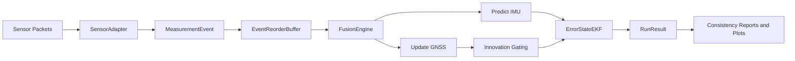

# Architecture

## Modules

- `navfusion.core`: canonical state and event types, time/reorder primitives
- `navfusion.models`: motion and measurement models
- `navfusion.filters`: filter contracts and EKF implementation
- `navfusion.engine`: orchestration and async event handling
- `navfusion.results`: run histories and summaries
- `navfusion.analysis`: consistency metrics (`NIS`, `NEES`)
- `navfusion.sensors`: raw packet to event adapters
- `navfusion.viz`: plotting helpers

## Data path

1. Raw packet -> sensor adapter -> `MeasurementEvent`
2. Event enters reorder buffer (`reorder_window_ns`)
3. Events emitted in deterministic timestamp order
4. IMU events drive prediction
5. GNSS events trigger catch-up prediction + update + gating
6. Histories and diagnostics emitted as `RunResult`

## Runtime flow

## State

Nominal state:

- Position (3)
- Velocity (3)
- Attitude quaternion (4)
- Gyro bias (3)
- Accel bias (3)

Error covariance state (15):

- `dp`, `dv`, `dtheta`, `dbg`, `dba`
